# Autonomous Maze Robot

This repository refers to a project involving a robot navigating a maze as quickly as possible without colliding during the course.

  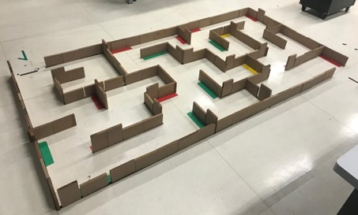
  
 

• **Reactive behavior:** The robot has motor control for obstacle avoidance using an ultrasonic sensor model in a mapped environment.

• **Braitenberg vehicle-type reactive behavior:** The robot either follows or moves away from one (or more) light sources while also avoiding obstacles.

• **Reactive maze-solving:** The robot must efficiently navigate a maze by avoiding obstacles and minimizing time.
  
The robot assembly primarily utilized components from the LEGO Kit 9790 (Mindstorms for Schools), consisting of 726 pieces.
A detailed list of kit pieces used in the robot's development.

### Mechanical Parts Table
|  **Parts** | **Quantity**| 
|-------------|-------------|
| Gray Bushing 1/2   |  6  |
| Gray Lego Bushing      | 4     |
| Axle 6L without Stop Black   | 2      |
|Gear 40 Teeth Gray | 2|
|Gear 8 Teeth Type 1 Gray| 2|
|Mini Electric Motor 9V Gray RCX 43362| 2|
|Plate 1x10 Gray| 2|
|Plate 1x2 Gray| 7|
|Plate 1x8 Gray| 2|
|Plate 2x10 Gray|3|
|Plate 2x2 Blue|4|
|Plate 2x2 Gray|2|
|Plate 2x4 Gray|4|
|Plate 2x6 Gray|4|
|Plate 2x8 Gray|5|
|Plate 6x10 Gray|2|
|Plate 6x10 Black|2|
|Round Plate 1x1 Blue|2|
|Tire 81.6x15| 4|
|Wheel 81.6x15|4|
|Brick 1x12 with 11 holes Black|4|
|Brick 1x2 with 1 hole Black|4|
|Brick 1x4 with 3 holes Black|2|
|Brick 1x8 with 7 holes Black| 9|
|Brick 2x4 Black| 2|
|Brick 2x6 Black|2|

The main locomotion of the robot was achieved through the integration of 9V electric motors of the Lego 43362 Power Motor Technic Mindstorms RCX 43362 model. 
Additionally, a ball transfer mechanism was incorporated into the front part of the robot to provide a higher degree of freedom, range of motion, and the ability to rotate 
around its own axis.

The hardware includes an Arduino ADK with an Atmel AVR microcontroller, featuring Atmega2560, 8 bits, and 16 MHz, 54 pins, 8KB RAM, 256 KB flash, and 5V.

Ultrasonic sensors of the HC-SR04 type were used to address the reactive maze-solving challenge, enabling effective obstacle detection and evasive maneuvers in the shortest 
possible time. Additionally, LDR (Light Dependent Resistor) photoresistors were incorporated to give the robot a Braitenberg vehicle-type reactive behavior, causing the robot
to flee from light sources and avoid obstacles, with the assistance of ultrasonic sensors.

The entire system was powered by a rechargeable 9V battery. A 170-point Protoboard was directly connected to the Arduino's 5V, powering all components except for the motors,
which received direct power from the battery. A toggle switch was incorporated to allow selective activation of the circuit when necessary. The motors were connected to an
H-bridge (L298N) that, through electronic switching, allows variation in the motor's rotation states. This represents a more efficient approach compared to mechanical 
switching and provides additional protection against overcurrent. 

### Electrical Components Table
|  **Components** | **Quantity**| 
|-------------|-------------|
|Brick 2x2 Eletric Conector Black| 2|
|Arduino Mega ADK| 1|
|Battery 9V 450mAh| 1|
|Toggle Switch 2 pins| 1|
|Battery Clip 9V Black- Type 1|1|
|Plug Connector P4 Male|1|
|H-Bridge Driver L298N| 1|
|Mini Protoboard 170 points|1|
|Resistor 10K Ohm 10%|4|
|Photoresistor LDR| 4|
|Ultrasonic sensor HC-SR04| 3|
|Spherical Transfer RO53XX15XX, REXroth,7210|1|

O assembled prototype, upon reviewing the list of mechanical components that were presented, seems large; however, the model ended up being compact, resulting in ease of navigation through the maze. The prototype yielded positive results; in the initial tests, it experienced minor collisions with the maze walls. However, after adjusting its speed and ultrasonic sensors, the robot navigated the course with agility, with four standout performances in the tests:

• **The first:** The robot tended to lean to the left, causing its side to collide with the wall. By correcting the lateral sensors, it was possible to maintain a minimum distance for the robot to adjust its direction and move straight within the maze.

• **The second:** The robot reached the halfway point but collided due to its speed, making it unable to navigate the tighter turns of the maze. Since it was moving too quickly, it was necessary to sacrifice some speed to successfully navigate the tight corners.

• **The third:** The robot completed the entire course, entering various dead-end sections of the maze and successfully navigating out without any issues.

• **The fourth:** By adjusting minor settings in the sensor and software, the robot managed to complete the entire course in around 1:08 minutes without apparent problems.

 
  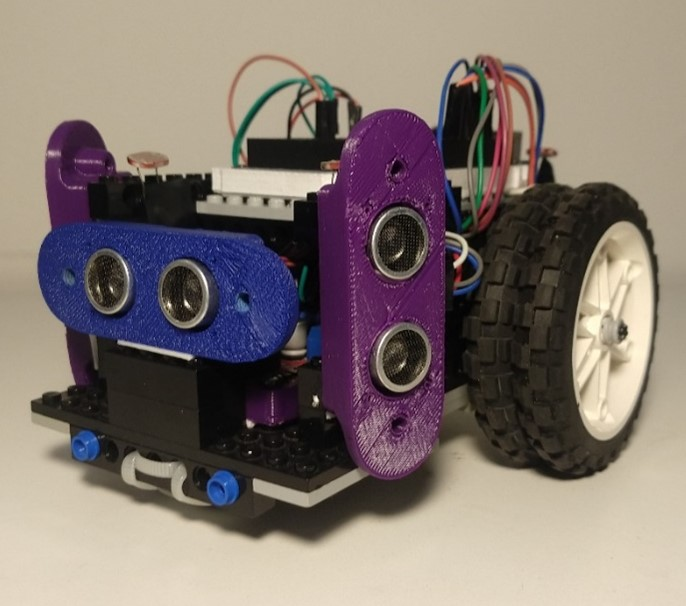
  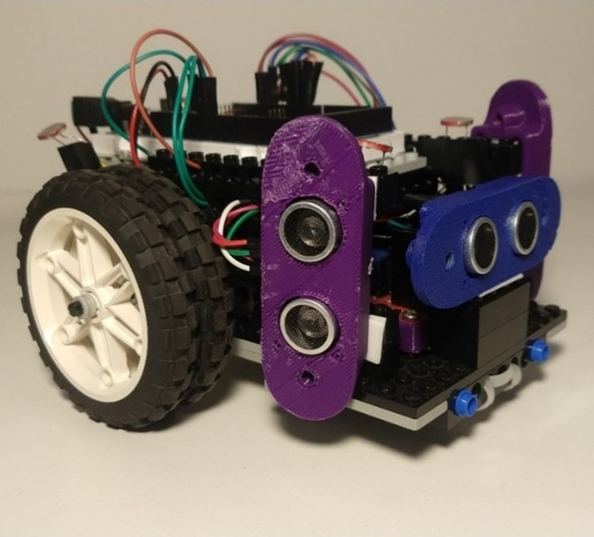
  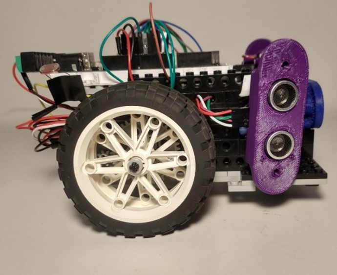
  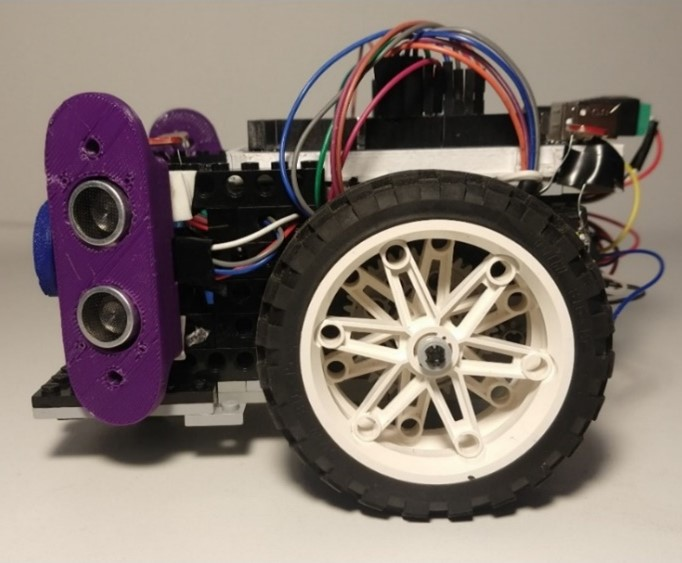
  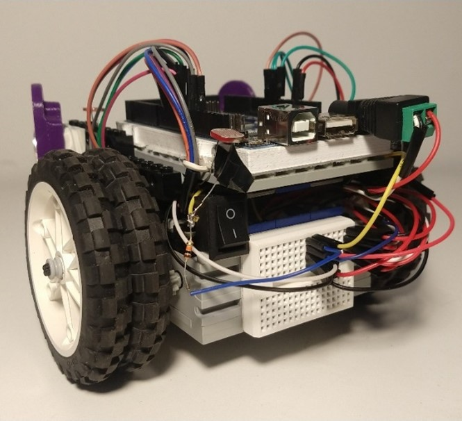
  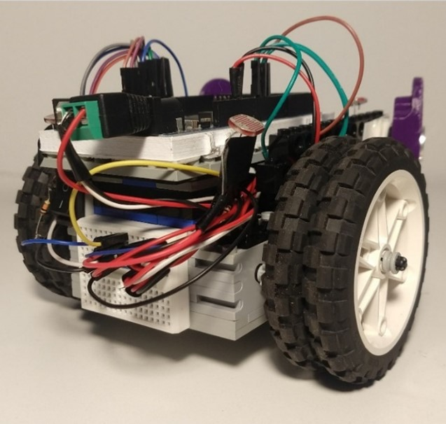
  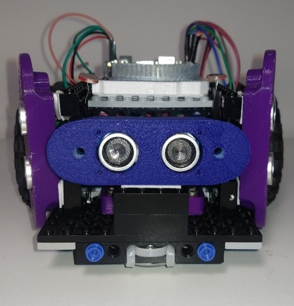
  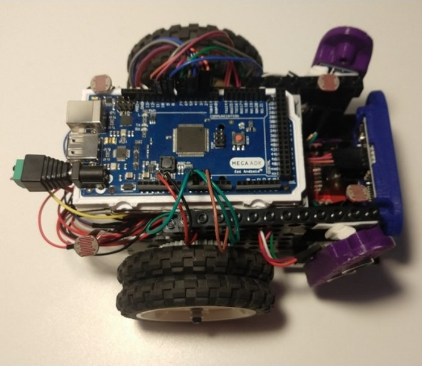
  
 

## Computer Vision Path Tracking System with ArUco Markers
### • Explanation of the purpose of ArUco markers
ArUco markers are widely used in computer vision and object tracking. Their main purpose is to provide easily identifiable reference points in environments that can be used to track the position and orientation of objects, such as robots, cameras, or any object equipped with ArUco markers. The markers are printed on sheets of paper, cardboard, or other materials and contain encoded information that makes them unique. Vision systems can detect, identify, and track these markers in real-time.

To generate the markers, it is necessary to use a code dictionary (e.g., DICT_4X4_50) that specifies the format of the markers and their ID, where "4x4" indicates the marker's size, which can also be 5x5 or 6x6, and "50" indicates the total number of distinct markers available in the dictionary. Marker generation is performed using computer vision libraries such as OpenCV. The software creates the markers and prints them for use in practical applications.

Marker identification occurs when a camera captures an image of the environment and detects the markers in the frame. Through image processing techniques, the software identifies the position and orientation of each marker and uses this information to perform tasks such as mapping, localization, and navigation.

### • Description of the Environment Configuration:

The configuration of the environment must be carefully planned to allow for the efficient detection of ArUco markers. The camera should be positioned to have a clear view of the markers. This involves choosing the height and angle of the camera, as well as defining the camera's field of view (FOV). The markers should be well distributed in the environment to ensure they are visible from various positions.

### • Usage/Implementation of Image Preprocessing Techniques:

To enhance the detection and identification of ArUco markers, it is common to apply image preprocessing techniques. This may include the application of filters to reduce noise in the image, segmentation to separate the markers from the background, and binarization to make the markers more visible. Lens distortion correction techniques may also be necessary depending on the camera used. Some of the techniques that would be interesting to work on in this context include:

• **Filtering:** A common preprocessing step is filtering, which aims to smooth the image and reduce noise, making the markers more visible. Applying filters such as the mean filter, Gaussian filter, or median filter helps eliminate random noise and improve the quality of the captured image.

• **Binarization:** Binarization is another relevant technique used to convert the image into a black-and-white representation, where the markers appear as white regions on a black background. This simplifies the detection of edges and contours of the markers, facilitating subsequent identification.

• **Segmentation:** Segmentation is useful for isolating the markers from the rest of the image, separating them into regions or objects of interest. This technique contributes to more precise detection, allowing the algorithm to focus exclusively on the markers, avoiding interference from other elements in the scene.

• **Distortion Correction:** In cases where the camera is subject to distortions, such as lens distortion, it is essential to correct them during preprocessing. Distortion can significantly affect the accuracy of marker detection. Therefore, distortion correction, usually based on camera calibration parameters, is an important step to ensure image fidelity.

The implementation of these preprocessing techniques is often carried out through image processing libraries such as OpenCV. The order and selection of techniques to be used may vary depending on the specific conditions of the camera, environment, and markers. Therefore, the choice and configuration of preprocessing techniques should be adjusted according to the particular scenario and may require tuning and experimentation to optimize the quality of ArUco marker detection.

 
  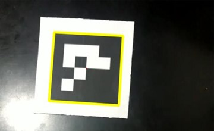

 

### •  Implementation

With the created code, the significant result obtained becomes evident, where the red line traces the robot's path through the maze in a clear and precise manner, as mentioned earlier. This visual representation of the trajectory, captured in real-time, attests to the success of using the ArUco marker to record the robot's journey. The success is twofold, as not only did the marker-based tracking system function effectively, but the robot's performance was also remarkable, successfully completing the course without causing damage to the maze walls. This achievement illustrates the effectiveness of the combination of tracking and navigation technologies used in this specific project.

 
  

 

## Simulation 
The continuation of the autonomous robotics project focuses on the simulation of virtual environments through 3D reconstruction. The first phase of the project involved the use of a mobile robot equipped with ultrasonic sensors, aimed at navigating a maze in a controlled physical environment. In this initial phase, ArUco markers were employed to record and map the path taken by the robot, providing crucial data for understanding the environment.

In this second phase, the goal is to transcend the physical representation of the maze to a virtual version through the 3D reconstruction of the environment. This will involve the use of computer vision techniques and image processing to capture data from the physical environment and transform it into three-dimensional models. This approach not only aims to create a visual representation of the maze but also provides an accurate digital simulation that will enable the analysis, enhancement, and testing of robot navigation algorithms in a virtual environment faithful to reality.

By combining concepts of computer vision, autonomous robotics, and 3D reconstruction, this work aims to contribute to the advancement of autonomous navigation strategies in unknown environments, providing a solid foundation to enhance the ability of mobile robots to deal with complex and dynamic scenarios. This report describes the process, challenges encountered, methods used, and results achieved in the implementation of this project.

A capturing and simulating mazes with virtual robots is a complex task that requires the use of specific tools and techniques. Here, we present a method to accomplish this task using the tools Meshroom and CoppeliaSim.

The first step involves capturing the physical maze. To do this, we use the Meshroom tool, a 3D model reconstruction software from images. Meshroom captures the outline of the maze and reconstructs the model using the AliceVision framework. The software can deliver high-quality models with textures close to reality.

The maze capture process is as follows:

• The physical maze is photographed from different angles.

• The images are processed by Meshroom, which generates a 3D model of the maze.

• The 3D model is refined to improve its quality.

The second step involves creating the virtual robot. For this, we use the CoppeliaSim tool, a robot simulation software. CoppeliaSim allows the creation of 3D robots in a virtual environment. The software enables the reconstruction and manipulation of simulations, applying the robot model in 3D modeling and the scenario captured with Meshroom for simulation and application.

The creation process of the virtual robot is as follows:

• The 3D model of the robot is created in a 3D modeling software.

• The 3D model of the robot is imported into CoppeliaSim.

• The motion and control parameters of the robot are configured.

The third step involves simulating the robot in the maze. To do this, we import the model of the virtual robot created in CoppeliaSim into the scenario captured with Meshroom. Then, we configure the robot simulation by defining the motion and control parameters.

The process of simulating the robot in the maze is as follows:

• The model of the virtual robot is imported into the maze scenario.

• The motion and control parameters of the robot are configured.

• The robot simulation is initiated.

The proposed method can be improved in various ways. For example, the quality of the 3D model of the maze can be enhanced by capturing more images or using more advanced image processing techniques. Additionally, the accuracy of the robot simulation can be improved by adjusting the motion and control parameters.

A accomplishment of three-dimensional reconstruction of complex environments, such as the maze we used in our work, using photogrammetric techniques presented significant challenges. The Meshroom software was employed to reconstruct the maze from 291 photos captured from various angles, indicating the origin of each photo in the 3D reconstruction process. However, obstacles were encountered, resulting in a reconstruction considered unsatisfactory.

 
  

 

To generate the depth map, a downscale of 16 was applied to optimize the manipulation of depth information. However, smaller downscales caused errors in the process due to high computational demand, especially on the machine's processor. This high computational cost limited the software's ability to efficiently construct the maze. In the meshing stage, crucial for the formation of the 3D mesh, 4,008,000 maximum points and a texture side of 4096 were used, while keeping the other parameters at the software's defaults. Despite these configurations, the complexity of the maze prevented Meshroom from completely overcoming processing difficulties, resulting in a reconstruction below expectations.

A suggested approach to improve 3D reconstruction would be to preprocess the images before importing them into Meshroom. Despite the software performing white balance, reducing the contrast between maze structures and the ground, the quality of captured information can be improved. Additionally, creating more depth between maze components can be achieved through image processing techniques.

 
  
  

 

Given the size of the maze, it is advisable to consider capturing a larger number of photos to achieve a more comprehensive reconstruction. Obtaining more perspectives of the environment can provide the software with additional information, contributing to a more detailed and accurate reconstruction.

It is observed that most of the maze walls were not reconstructed properly, showing various structural flaws and preserving only part of the original path configuration.
In response to the previously identified issue, it was essential to make adjustments to the three-dimensional representation of the maze using Blender software.

 
  
  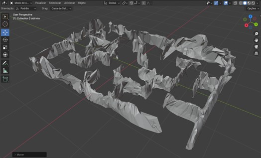

 

With the aim of comprehensively simulating the project in a virtual manner, we developed a program to represent the path traveled by the robot using a black line. This allows for a reassessment of the route taken in the physical environment, and upon making a comparison, we identified some discrepancies in its path. These variations are attributed to the necessary adaptations to transpose the physical scenario to the virtual one. It is relevant to note that the robot in CoppeliaSim is equipped with 16 ultrasonic sensors, a significant contrast compared to the previous robot that had only 3 sensors.

 
  
  

 

A 3D reconstruction of a maze using Meshroom presented considerable challenges, mainly due to computational costs and the complexity of the environment. Strategies such as image preprocessing and acquiring more visual data can be implemented to optimize future reconstruction attempts. The 3D model of the maze generated by Meshroom was unsatisfactory due to the flaws on the maze walls, which appeared smaller or did not exist in the model. This is partly due to the limitations of the hardware we used to generate the 3D model.

However, to achieve a satisfactory result, we could try using better hardware, which would help overcome the computational limitations we faced. Another approach could be to use different software for compiling images into a 3D model, such as Polycam. We made some attempts with the free version but didn't have the necessary number of photos to generate a minimally recognizable 3D model. However, with the paid version, we might achieve better results; whether it would be of higher quality than what was generated in Meshroom remains uncertain.

In addition to the challenges encountered during the 3D reconstruction phase, using CoppeliaSim for simulation proved to be a challenging process. As mentioned earlier, the lack of familiarity with the software resulted in additional complexity in performing tasks that could initially be straightforward, such as configuring the robot's functionalities. Considering this experience, we identified opportunities for subsequent improvements, including a more precise reconstruction of the simulated environment and the use of the real robot model, combined with programming that closely resembles reality. This approach would enable the creation of a more faithful and accurate "Digital Twin".

## License
This project was developed for the Autonomous Robotics course at the Pontifícia Universidade Católica do Paraná (PUCPR). It has no commercial intention, serving only for study and learning purposes about autonomous robotics, computer vision, and simulations.

## Project Team 

• ANDRE HENRIQUE GONÇALVES DA SILVA 

• MATHEUS POMPEU DE CARVALHO 

• NATHAN KOREVAR STACHIO 

• NICOLAS HUPFELD 

• TATSUYA OZAWA 
